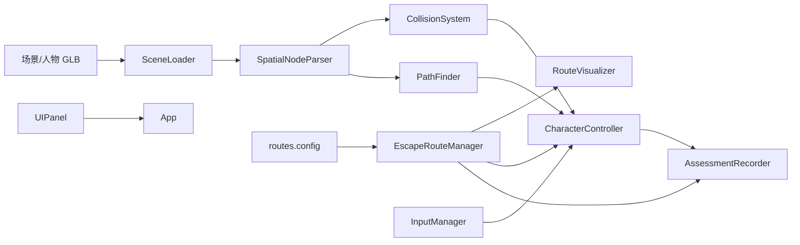

# 消防逃生数字模拟仿真系统 — 系统架构

## 1. 业务目标

面向**室内封闭空间**消防员逃生路线考核与多地形动作模拟，核心闭环：

```
场景加载 → 空间节点解析 → NavMesh/图寻路 → 路线规划
    → 人物动作调度(AI/手动) → 碰撞/地形检测 → 考核统计 → 轨迹回放
```

## 2. 模块划分（六层解耦）

| 层级 | 模块 | 职责 |
|------|------|------|
| 入口 | `main.js` / `App.js` | 生命周期、模块装配、渲染循环 |
| 场景 | `SceneLoader` / `SpatialNodeParser` / `EnvironmentSetup` / `SmokeParticles` | GLB 加载、节点标记、灯光烟雾、路径标线 |
| 物理 | `CollisionSystem` / `CollisionLayers` | Raycaster + AABB 分层碰撞、地形探测 |
| 导航 | `PathFinder` / `RouteVisualizer` | 网格图 A* 寻路、路线 3D 可视化 |
| 路线 | `EscapeRouteManager` / `RouteDeviationTracker` | 多路线管理、偏离预警 |
| 人物 | `CharacterController` / `AnimationController` / `TerrainActionDetector` | 骨骼动画混合、AI/手动控制、地形动作切换 |
| 考核 | `AssessmentRecorder` / `ReplaySystem` | 耗时/动作/偏离统计、回放 |
| 交互 | `InputManager` / `UIPanel` | 键盘操控、面板控制 |
| 配置 | `simulation.config.js` | 模型路径、命名约定、考核规则 |

## 3. 数据流



## 4. 关键技术选型

### 4.1 碰撞 — Raycaster + AABB（无重型物理引擎）

- **墙体/障碍层**：Capsule-Box 相交 + 滑动修正，防止穿墙
- **地面/楼梯层**：垂直 Raycast 取最高交点作为 Y
- **地形探测**：前方 `probeTerrain()` 检测低矮通道、孔洞、楼梯、障碍

### 4.2 寻路 — 网格图 A*（可升级 Recast NavMesh）

当前实现：基于 `navZone` 烘焙 1m 网格节点，A* 连通，线段碰撞校验。

**升级路径**：导出 Blender 导航网格 → `@recast-navigation/three` 烘焙 → 替换 `PathFinder.buildNavGraph()`。

### 4.3 动画 — AnimationMixer 统一调度

- 所有 clip 映射到语义动作名（`jog`/`crawl`/`stairUp` 等）
- `crossFadeTo()` 实现 0.25s 平滑过渡
- `TerrainActionDetector` 根据前方地形自动切换动作

### 4.4 性能优化策略

| 策略 | 实现位置 |
|------|----------|
| 像素比限制 `min(dpr, 2)` | `App._initRenderer` |
| 烟雾粒子 30fps 节流 | `SmokeParticles.update` |
| 阴影贴图 2048 | `EnvironmentSetup` |
| 几何合并（生产场景） | 建模阶段 / 后处理脚本 |
| LOD（生产场景） | GLB 多细节层级 |

## 5. 动作状态机

```
idle ←→ walk/jog/run
         ↓ (lowPassage)
       crawl
         ↓ (stair)
    stairUp / stairDown
         ↓ (hole)
  crouchHole / squeezeHole
         ↓ (obstacle)
      vault / jump
```

触发优先级：**lowPassage > hole > stair > obstacle > defaultMove**

## 6. 考核判定逻辑

1. **路线合规**：最终位置距路线终点 < 2m
2. **动作合规**：`requiredActions` 全部完成
3. **时间合规**：`elapsed <= timeLimitSeconds`
4. **偏离合规**：`deviationCount <= maxDeviationCount`
5. **扣分项**：超时 -30、每次偏离 -10、缺失动作 -15

## 7. 控制模式

| 模式 | 说明 |
|------|------|
| AI 自动 | 选定路线 → `expandRoute()` → 逐 waypoint 移动 + 地形动作 |
| 手动操控 | WASD + Shift/Ctrl + C/Space/E/F 触发动作，系统校验地形匹配 |
| 回放 | 读取 `AssessmentRecorder.recording` 帧序列 |
